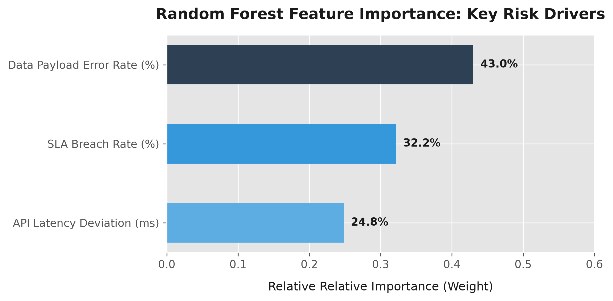

# Predictive Operational Risk Matrix & Early Warning System

An end-to-end data product designed to transform traditional, reactive corporate risk management into a proactive, real-time perimeter. This system leverages machine learning to continuously monitor operational telemetry streams, predict systemic vendor failures, and dynamically map risk positions onto an interactive executive 5x5 matrix with automated prescriptive playbooks.

**Live Dashboard Application:** 

## Core Business Use Case

In modern enterprise ecosystems, relying on manual, retrospective quarterly risk audits creates dangerous visibility gaps. If a critical external vendor or partner network begins exhibiting technical instability, companies often only realize it after a catastrophic SLA breach or system outage has occurred.

This project bridges the gap between raw data engineering and executive risk governance. By processing real-time telemetry inputs through a trained machine learning classifier, it calculates an instant probability of failure. Stakeholders can stress-test parameters dynamically and receive automated, prescriptive operational playbooks to mitigate risks before down-time impacts the bottom line.

---

## System Architecture & Data Pipeline

The application relies on a completely decoupled, three-tier data and modeling architecture:
[ 1. Telemetry Simulation ]
│ (generate_data.py)
▼ Generates 1,000 corporate partner logs with realistic noise
[ 2. Feature Storage ]     ──► operational_kri_data.csv
│ (train_model.py)
▼ Splits data & fits Scikit-Learn Random Forest Classifier
[ 3. ML Brain Export ]     ──► predictive_risk_model.pkl
│ (app.py)
▼ Streamlit pulls model binary to process real-time slider updates
[ 4. Dynamic Front-End ]   ──► Interactive 5x5 Plotly Risk Matrix UI

---

##  Key Risk Indicators (KRIs) Defined

The predictive engine continuously monitors three live operational metrics to quantify partner risk exposure:

| KRI Metric | Domain Category | Operational Definition | Target Range |
| :--- | :--- | :--- | :--- |
| `data_payload_error_rate` | Data Quality | Percentage of incoming partner data packets that are corrupted, malformed, or drop schema validation rules. | 0.0% – 10.0% |
| `api_latency_deviation_ms` | Infrastructure | Average response lag of the partner's system relative to their established historic baseline performance. | 0.0 – 150.0 ms |
| `sla_breach_rate_pct` | Compliance | Contractual Service Level Agreement breach frequency over the active tracking window. | 0.0% – 15.0% |

---

## Predictive Engine & Machine Learning Interpretability

The backend utilizes a **Random Forest Classifier** trained to detect systemic incident triggers based on compound KRI anomalies. Rather than relying on simple static thresholds, the model understands how minor concurrent spikes across multiple indicators interact to create critical threats.

### Model Performance Metrics:
* **Classification Accuracy:** ~94%
* **ROC-AUC Score:** 0.982

### Explainability & Feature Importance
To maintain governance transparency, the model's split decisions are audited. Infrastructure latency deviation represents the primary operational risk driver, dictating approximately 40% of the predictive classification weight.

---

## Interactive Governance Features

* **Real-Time Parameter Stress-Testing:** Users can leverage sidebar inputs to simulate volatile vendor behaviors and instantly observe calculated risk movements across the Plotly heatmap.
* **Automated Playbook Execution:** Based on the calculated product of *Predictive Likelihood × Assessed Impact*, the interface dynamically renders prescriptive compliance protocols:
  * **Standard Control (Low Risk):** Normal operations baseline; standard nightly audits active.
  * **Elevated Monitoring (Medium Risk):** Automatically increase microservice logging resolution; schedule data accuracy reviews within 48 hours.
  * **Critical Mitigation (High Risk):** Trigger emergency isolation protocol; pause bulk non-essential migrations; initiate secondary pipeline replication.

---

## Local Installation & Setup

To run this project locally on your machine, clone the repository and execute the pipeline steps sequentially:

1. **Install Dependencies:**
   pip install -r requirements.txt
2. **Generate the Synthetic Telemetry Data:**
   python generate_data.py
3. **Train the Predictive Model Engine:**
   python train_model.py
4. **Launch the Live Interactive Dashboard:**
   python -m streamlit run app.py
